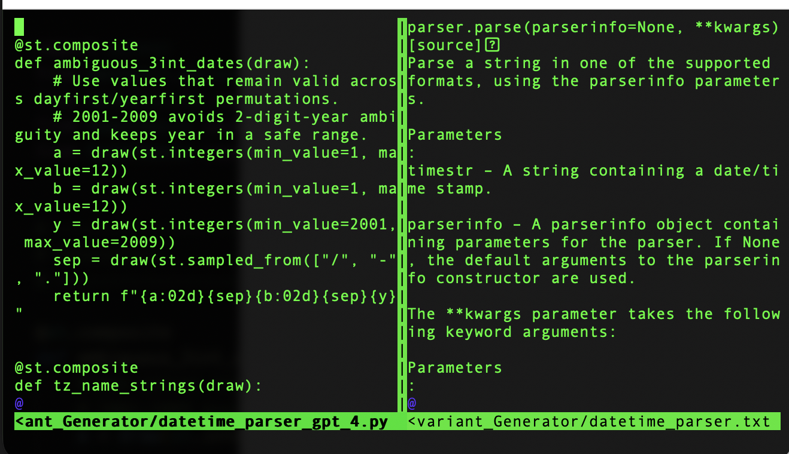
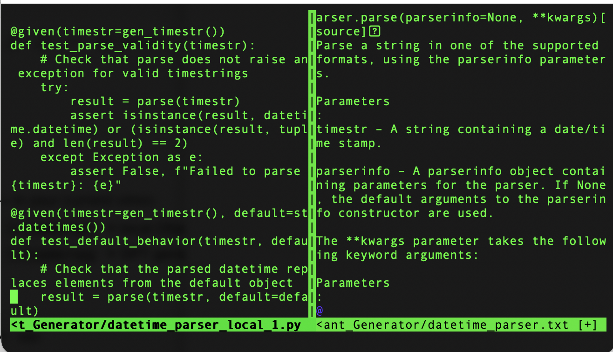

# Automated Property-Based Testing Via API Documentation Invariant Generator In VIM

Research prototype by Michael Wu, May 2026.

This project explores whether language models can turn Python API
documentation into executable property-based testing invariants. Given a short
documentation excerpt, the system prompts a model to generate Hypothesis tests
that encode semantic properties of the API under test.

The current prototype compares two generation paths:

- a local open-weight model served through Ollama
- an OpenAI-hosted model served through the OpenAI Python SDK


## Method


```text
API documentation snippet
        |
        v
Invariant-generation prompt
        |
        +----------------------+
        |                      |
        v                      v
Local Ollama model       OpenAI model
        |                      |
        v                      v
Generated Hypothesis tests / invariants
        |
        v
Manual inspection and execution
```

## Case Studies

| API | Documentation input | Local-model output | OpenAI-model output |
|---|---|---|---|
| `dateutil.parser.parse()` | [`datetime_parser.txt`](./datetime_parser.txt) | [`datetime_parser_local_1.py`](./datetime_parser_local_1.py) | [`datetime_parser_gpt_1.py`](./datetime_parser_gpt_1.py) |
| `torch.stack()` | [`torch_stack.txt`](./torch_stack.txt) | [`testing_torch_stack_qwen.py`](./testing_torch_stack_qwen.py) | [`torch_stack_gpt_invariants.py`](./torch_stack_gpt_invariants.py) |


## Example Outputs

### Hosted Model Output

GPT 5.4 mini generated output is robust and captures idiosyncratic invariants

<p align="center">
  
</p>

### Local Model Output

Local model generated output is not robust, which makes sense due to the low parameter count

<p align="center">
  
</p>


## Repository Structure

| Path | Purpose |
|---|---|
| [`invariant_suggestor.py`](./invariant_suggestor.py) | Local generator using Ollama and `qwen2.5-coder:14b`. |
| [`invariant_suggestor_gpt.py`](./invariant_suggestor_gpt.py) | Hosted generator using the OpenAI Python SDK. |

## Installation

For OpenAI generation, set an API key in the shell environment before launching
Vim:

```bash
export OPENAI_API_KEY="..."
```

## Vim Setup

Open your Vim configuration:

```bash
vim ~/.vimrc
```

Paste the following block into `~/.vimrc`:

```vim
" ============================================
" Automated Invariant Generator
" ============================================

function! MakeOutfile(kind)
    let l:timestamp = strftime("%Y%m%d_%H%M%S")
    return expand("%:p:h") . "/generated_" . a:kind . "_invariants_" . l:timestamp . ".py"
endfunction

" ============================================
" Local Ollama/Qwen Generator
" ============================================

function! GenerateInvariantsLocal()

    " Temporary file for selected text
    let l:tmpfile = tempname()

    " Unique output file
    let l:outfile = MakeOutfile("local")

    " Save visual selection into temp file
    silent execute "'<,'>write " . l:tmpfile

    " Python command
    let l:cmd =
                \ "python3 "
                \ . shellescape("/Users/michaelwu/Documents/cmu_codebase/learning_projects/Automated_Invariant_Generator/invariant_suggestor.py")
                \ . " < "
                \ . shellescape(l:tmpfile)
                \ . " 2>&1"

    " Run script
    let l:output = system(l:cmd)

    " Delete temp file
    call delete(l:tmpfile)

    " Open new vertical split with output filename
    execute "vnew " . fnameescape(l:outfile)

    " Configure buffer
    setlocal filetype=python
    setlocal noreadonly

    " Insert generated output
    call setline(1, split(l:output, "\n"))

    " Save file to disk
    write!

    echo "Saved local invariants to " . l:outfile

endfunction

" ============================================
" OpenAI GPT Generator
" ============================================

function! GenerateInvariantsGPT()

    " Temporary file for selected text
    let l:tmpfile = tempname()

    " Unique output file
    let l:outfile = MakeOutfile("gpt")

    " Save visual selection into temp file
    silent execute "'<,'>write " . l:tmpfile

    " Python command
    let l:cmd =
                \ "python3 "
                \ . shellescape("/Users/michaelwu/Documents/cmu_codebase/learning_projects/Automated_Invariant_Generator/invariant_suggestor_gpt.py")
                \ . " < "
                \ . shellescape(l:tmpfile)
                \ . " 2>&1"

    " Run script
    let l:output = system(l:cmd)

    " Delete temp file
    call delete(l:tmpfile)

    " Open new vertical split with output filename
    execute "vnew " . fnameescape(l:outfile)

    " Configure buffer
    setlocal filetype=python
    setlocal noreadonly

    " Insert generated output
    call setline(1, split(l:output, "\n"))

    " Save file to disk
    write!

    echo "Saved GPT invariants to " . l:outfile

endfunction

" ============================================
" Keybindings
" ============================================

" Local Ollama/Qwen
vnoremap <leader>pl :<C-u>call GenerateInvariantsLocal()<CR>

" OpenAI GPT
vnoremap <leader>pg :<C-u>call GenerateInvariantsGPT()<CR>
```

Save and exit Vim:

```vim
:wq
```

## How to Run

1. Open an API documentation snippet in Vim:

   ```bash
   vim datetime_parser.txt
   ```

2. Select the text to send to the invariant generator. To select the entire file
   in normal mode:

   ```vim
   ggVG
   ```

3. Run one of the visual-mode keybindings:

   ```vim
   \pg
   ```

   runs the OpenAI GPT generator.

   ```vim
   \pl
   ```

   runs the local Ollama/Qwen generator.

4. The generated invariants open in a new vertical split and are automatically
   saved as a timestamped Python file next to the documentation file.

5. If you used the local Ollama path, stop Ollama after generation:

   ```bash
   pkill ollama
   ```


