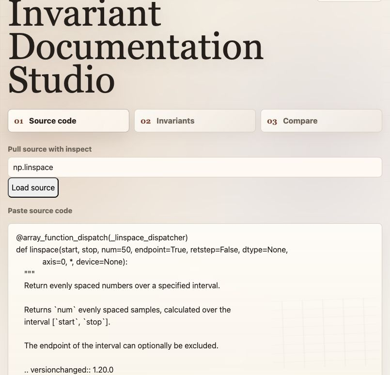
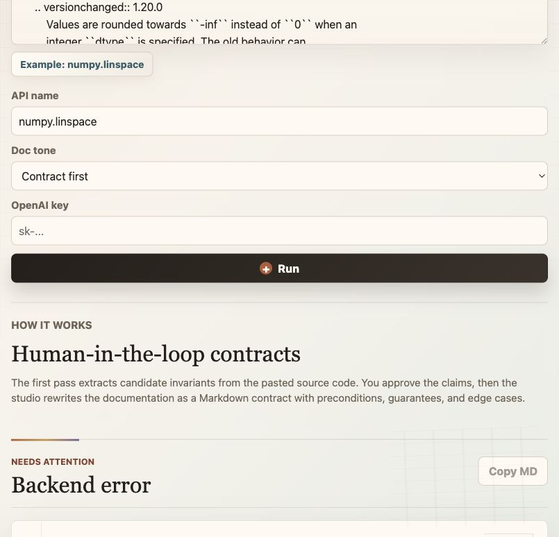

# Invariant-Based Documentation Generator

## Can Invariant Based Documentation Generation Create Better Documentation Than Traditional Documentation?

## Interactive Website Demo

This folder also includes a browser demo for the source-code-to-documentation
workflow:

```bash
cd PBT_Based_Documentation
python3 server.py
```

Then open:

```text
http://127.0.0.1:8011
```

The site lets you paste source code on the left, load the exact `numpy.linspace`
source example, paste an OpenAI API key, click **Run**, review the GPT-generated
candidate invariants on the right, and then generate a Markdown comparison
between the original source code and the invariant-based documentation.

You can also try pulling source code from an installed Python object name. The
site does the local backend equivalent of:

```python
import numpy as np
import inspect

print(inspect.getsource(np.linspace))
```

If lookup fails because the package is missing or the object cannot be
inspected, paste the source code manually.

Some library objects, such as `np.add`, are implemented as compiled ufuncs and
do not expose Python source through `inspect.getsource`. In those cases the app
loads a clearly labeled signature/docstring fallback so the button still gives
useful context, but true source-code analysis still requires pasted source.

### Demo Images

Source lookup with `inspect.getsource(np.linspace)`:



Backend key check before GPT calls:



The web server calls this folder's existing `gpt_documentation_generator.py`
OpenAI wrapper. The default model is `gpt-5.5`, or set `OPENAI_MODEL` before
starting the server to override it.

Note: viewing the files on GitHub or hosting only the static files will not run
GPT. Real generation requires this Python backend, or another server host that
can run `server.py`.


This directory contains a prototype workflow for reconstructing API
documentation from implementation-backed behavioral claims. The system extracts
candidate invariants from source code, asks for human review, generates
property-based tests, evaluates those tests, and promotes only sufficiently
supported claims into Markdown documentation.

## Workflow

```text
source code + JSON config
  -> candidate invariants
  -> human review
  -> generated Hypothesis tests
  -> validity / soundness / optional mutation metrics
  -> reconstructed documentation
```

The final documentation should not mention test metrics or mutation testing.
Those signals are used only as an internal filter for deciding which semantic
claims are strong enough to document.

## Recommended JSON Run

Use JSON configs for reproducible runs. The active NumPy example is:

```text
numpy_docs_config.json
```

Run from this directory:

```bash
cd /Users/michaelwu/cmu-research_PBT/Can-Agents-Write-Good-Property-Based-Tests/PBT_Based_Documentation
export OPENAI_API_KEY="your_api_key_here"
python3 gpt_documentation_generator.py --config numpy_docs_config.json
```

The first run writes review files and stops:

```text
artifacts/numpy/norm/human_review.md
artifacts/numpy/dot/human_review.md
artifacts/numpy/add/human_review.md
```

Edit each review file so it contains only accepted invariants. Then run the
same command again:

```bash
python3 gpt_documentation_generator.py --config numpy_docs_config.json
```

With `"auto_continue": true`, the runner automatically detects existing
`human_review.md` files and proceeds to test generation, metrics, and
documentation.

## JSON Format

Single API:

```json
{
  "source": "source_code/path/to/module.py",
  "function": "api_name",
  "model": "gpt-5.4-mini",
  "artifact_root": "artifacts",
  "run_mutation": false,
  "auto_continue": true,
  "min_validity": 0.8,
  "min_soundness": 0.8,
  "min_confidence": 0.75,
  "min_mutation": 0.25,
  "reviewer_notes": "Input-domain constraints or import notes."
}
```

Multiple APIs:

```json
{
  "model": "gpt-5.4-mini",
  "artifact_root": "artifacts/numpy",
  "run_mutation": false,
  "auto_continue": true,
  "apis": [
    {
      "source": "source_code/numpy/linalg/_linalg.py",
      "function": "norm",
      "reviewer_notes": "Document this as numpy.linalg.norm."
    },
    {
      "source": "source_code/numpy/_core/multiarray.py",
      "function": "dot",
      "reviewer_notes": "Document this as numpy.dot."
    }
  ]
}
```

Keep mutation testing disabled until validity and soundness are acceptable. Then
set:

```json
"run_mutation": true,
"mutation_dir": "metrics"
```

## Artifacts

Each API writes:

```text
artifacts/<api_name>/
  candidate_invariants.md
  human_review.md
  generated_tests.py
  metrics_report.md
  documentation_blocked.md          # only if the metric gate fails
  mutation_analysis.md              # only if mutation analysis runs
  reconstructed_documentation.md
```

Terminal statuses:

```text
[RUN]      active generation or execution
[OK]       artifact written or stage completed
[STOP]     waiting for human review
[BLOCKED]  metric gate failed
```

Set `NO_COLOR=1` to disable colored output.

## NumPy Documentation Comparison

Generated documentation in this repository:

- [`numpy.linalg.norm`](./artifacts/numpy/norm/reconstructed_documentation.md)
- [`numpy.dot`](./artifacts/numpy/dot/reconstructed_documentation.md)

Official NumPy documentation:

- [`numpy.linalg.norm`](https://numpy.org/doc/stable/reference/generated/numpy.linalg.norm.html)
- [`numpy.dot`](https://numpy.org/doc/stable/reference/generated/numpy.dot.html)

### Documentation Styles

The generated documentation is intentionally contract-oriented. It organizes
behavior around explicit invariants, preconditions, semantic guarantees, and
known edge cases. The standard NumPy documentation is usage-oriented. It gives
the public API signature, parameter descriptions, examples, and mathematical
reference material.

| Dimension | Invariant-based documentation | Standard NumPy documentation |
|---|---|---|
| Core philosophy | Contract-first: documents rules, guarantees, and failure modes. | Usage-first: describes what the function does and shows representative outputs. |
| Edge-case handling | Explicit: edge cases are separated into dedicated sections. | Often implicit: edge cases may be embedded in notes, tables, or examples. |
| Error visibility | Defensive: invalid combinations and likely exceptions are surfaced near the relevant behavior. | Reference-oriented: exceptions are documented, but not always connected to each semantic mode. |
| Readability | Scannable: separates vector, matrix, scalar, axis, and dtype behavior where possible. | Dense: compact tables and long examples can require more cross-reading. |
| Examples | Minimal and targeted toward semantic distinctions. | Broad and literal, often matching interactive numerical exploration. |
| Research utility | Useful for deriving tests, wrappers, static checks, and documentation claims. | Useful as the canonical public reference and mathematical baseline. |

### Invariant-Based Documentation Generator

The official documentation is the better complete reference for quick syntax
lookups, mathematical context, and raw API signatures. The invariant-based
documentation is more useful as a behavioral contract: it foregrounds
preconditions, semantic guarantees, boundary cases, and predictable failure
modes.

For a developer concerned with robustness, readability, and reducing runtime
edge-case failures, the invariant-based version is the better starting point.
For raw API completeness and interactive verification, the official reference
remains necessary.

In particular, the invariant-based documentation style is stronger for:

- codifying strict semantic guarantees over loose textual descriptions,
- making explicit which inputs should trigger documented exceptions,
- isolating high-risk edge cases into dedicated, scannable sections,
- shifting documentation from passive description toward an active, testable
  software contract.

The official documentation style is stronger for:

- comprehensive coverage of minor internal flags and low-level parameters,
- historical evolutionary context and mathematical/academic citations,
- copy-pasteable terminal outputs for immediate interactive verification in a REPL.

Overall, the invariant-based style is better when the goal is to write robust production code, automated test suites, input validators, or static-analysis rules. The standard documentation style is better when the goal is a complete public reference or a quick confirmation of raw numerical output.

## Notes

- Traditional documentation is optimized for reference and examples;
  invariant-based documentation is optimized for explicit behavioral claims.
- Ambiguous edge cases are a source of implementation and integration risk.
  Making them explicit improves testability and defensive use.
- An invariant-first workflow treats documentation claims as artifacts that can
  be reviewed, tested, and revised.
