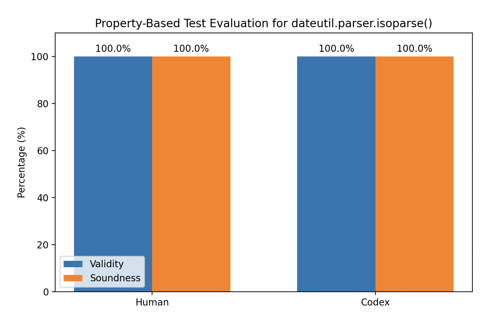
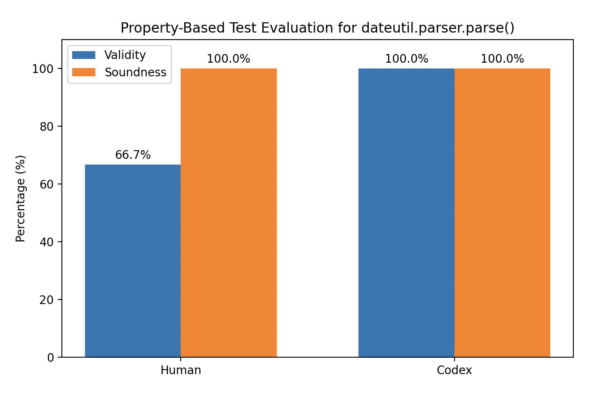
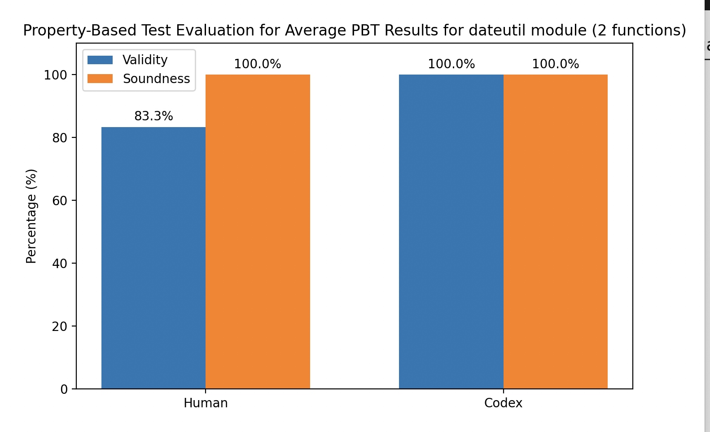

# Can Agents Write Good Property-Based Tests?

Project for the Carnegie Mellon University (CMU) REU program by Michael Wu, May 2026.

This repository studies whether a modern coding agent can produce useful
property-based tests (PBTs) for real Python APIs via prompts only focused on documentation. The experiment is inspired by
the paper [Can Large Language Models Write Good Property-Based Tests?](https://doi.org/10.48550/arXiv.2307.04346)
and adapts its prompt-driven workflow to a Codex-style coding agent.

The central comparison is between:

- human-written Hypothesis tests with hand-designed invariants and strategies
- Codex-generated Hypothesis tests produced from API documentation and two-staged prompts

# Automated_Invariant_Generator
Generate PBT Tests Automatically via VIM in the background


## Tested Libraries

| Library | Version | APIs evaluated |
|---|---:|---|
| NumPy | `2.2.6` | `np.linspace()` |
| PyTorch | `2.7.0` | `torch.argmax()` |
| python-dateutil | `2.9.0.post0` | `dateutil.parser.isoparse()`, `dateutil.parser.parse()` |

## Methodology

Each API is evaluated with a small human-written PBT suite and a Codex-generated
PBT suite. The Codex tests are produced using the prompt templates in
[`two_staged_prompt.py`](./two_staged_prompt.py), which ask the model to extract
properties from documentation and then implement Hypothesis tests for those
properties.

The evaluation harness in [`metrics.py`](./metrics.py) runs each test function
1,000 times and reports two metrics:

- **Validity**: fraction of executions that do not raise unexpected exceptions.
- **Soundness**: fraction of executions that do not fail an assertion.

In this setup, validity failures usually indicate malformed strategies,
unhandled parser errors, or runtime exceptions. Soundness failures indicate that
the asserted property is false for at least some generated inputs.

## Test Artifacts

| API | Human-written test | Codex-generated test | Documentation |
|---|---|---|---|
| `np.linspace()` | [`human_test_np_linspace.py`](./human_PBT/np_testing/human_test_np_linspace.py) | [`test_codex_np_linspace.py`](./Codex/np_testing/test_codex_np_linspace.py) | [NumPy `linspace`](https://numpy.org/doc/2.3/reference/generated/numpy.linspace.html) |
| `torch.argmax()` | [`human_test_torch_argmax.py`](./human_PBT/torch_testing/human_test_torch_argmax.py) | [`test_codex_torch_argmax.py`](./Codex/torch_testing/test_codex_torch_argmax.py) | [PyTorch `argmax`](https://docs.pytorch.org/docs/2.12/generated/torch.argmax.html) |
| `dateutil.parser.isoparse()` | [`human_testing_isoparse.py`](./human_PBT/dateutil_testing/human_testing_isoparse.py) | [`test_codex_isoparse.py`](./Codex/dateutil_testing/test_codex_isoparse.py) | [`dateutil.parser.isoparse`](https://dateutil.readthedocs.io/en/stable/parser.html#dateutil.parser.isoparse) |
| `dateutil.parser.parse()` | [`human_testing_parser.py`](./human_PBT/dateutil_testing/human_testing_parser.py) | [`test_codex_parse.py`](./Codex/dateutil_testing/test_codex_parse.py) | [`dateutil.parser.parse`](https://dateutil.readthedocs.io/en/stable/parser.html#dateutil.parser.parse) |

## Quantitative Results

| API | Human validity | Human soundness | Codex validity | Codex soundness |
|---|---:|---:|---:|---:|
| `np.linspace()` | 100.0% | 66.7% | 100.0% | 100.0% |
| `torch.argmax()` | 99.0% | 100.0% | 100.0% | 100.0% |
| `dateutil.parser.isoparse()` | 100.0% | 100.0% | 100.0% | 100.0% |
| `dateutil.parser.parse()` | 66.7% | 100.0% | 100.0% | 100.0% |
| **dateutil average** | **83.3%** | **100.0%** | **100.0%** | **100.0%** |


## Figures

### Baseline From Prior Work

<p align="center">
  
</p>

The figure above reproduces the earlier paper's reported results for historical
comparison. The remaining figures show the local agent-vs-human evaluations in
this repository.

### NumPy and PyTorch

<p align="center">
  
  
</p>

### Dateutil Parser APIs

<p align="center">
  
  
</p>

<p align="center">
  
</p>


## Reproducing Results

From this directory:

```bash
python Codex/np_testing/test_codex_np_linspace.py
python Codex/torch_testing/test_codex_torch_argmax.py
python Codex/dateutil_testing/test_codex_isoparse.py
python Codex/dateutil_testing/test_codex_parse.py
python result_plot.py
```

The graph images are stored in [`graphs/`](./graphs/). The plotting script
contains the recorded metric dictionaries used to generate the figures.
