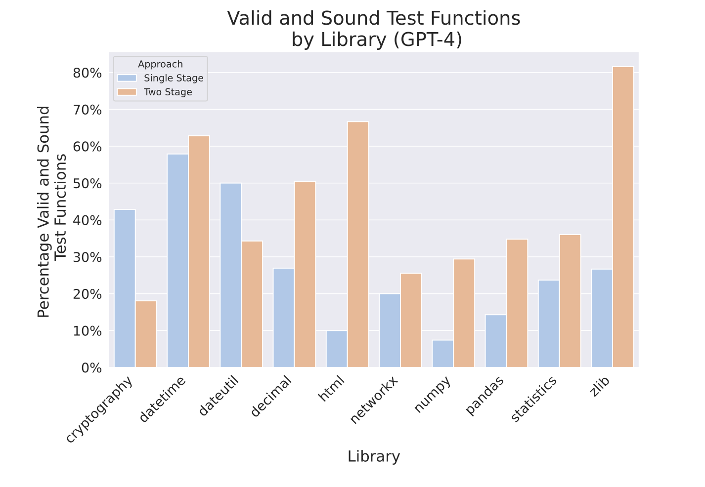
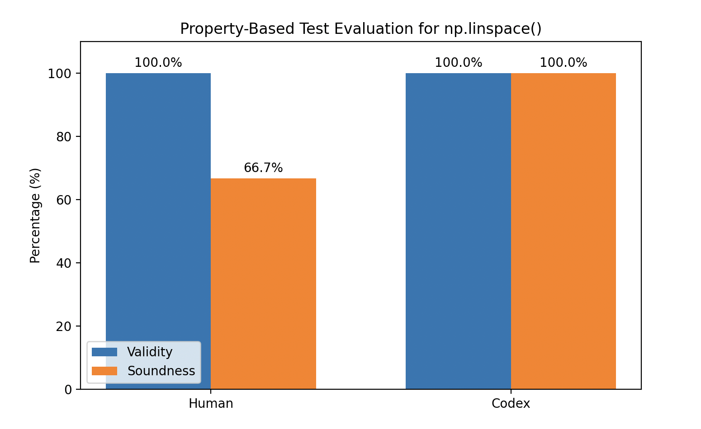
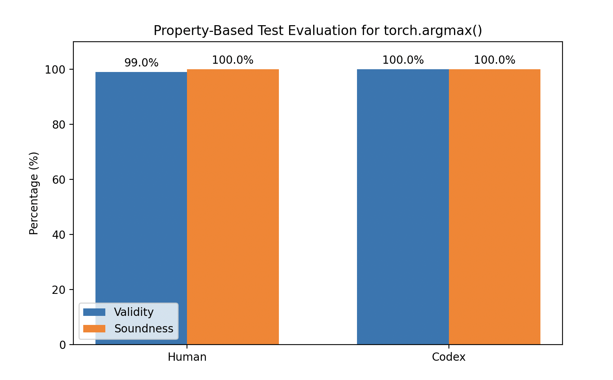
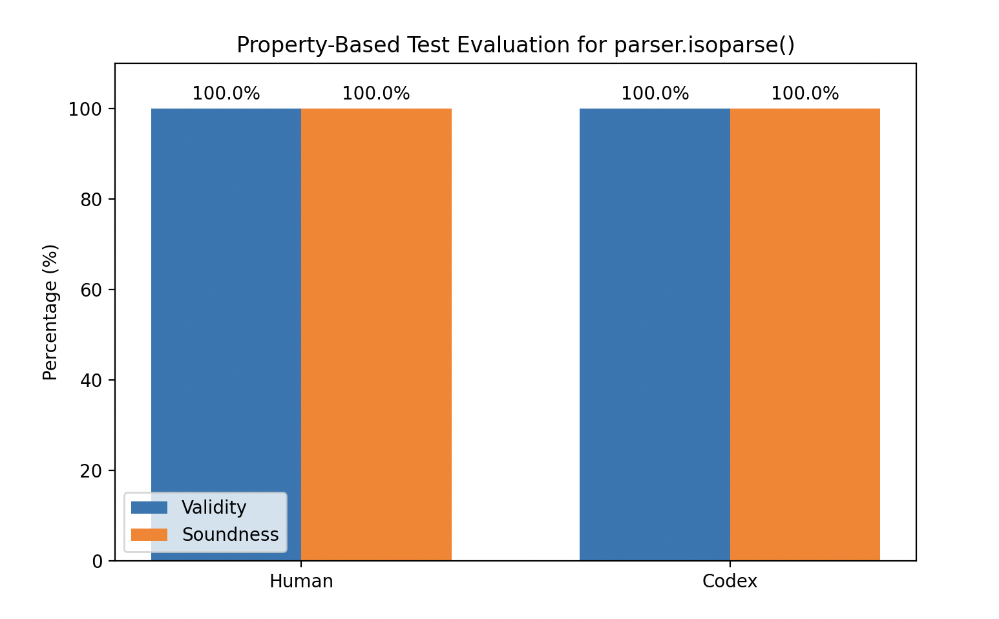

# Can Agents Write Good Property-Based Tests? 

Project for REU CMU by Michael Wu (05/26/2026). 

This project attempts to replicate similar examples from the paper: `Can Large Language Models Write Good Property-Based Tests?` `https://doi.org/10.48550/arXiv.2307.04346` in a modern-agent context while using the same prompts and comparing it to basic human written invariants and strategies via the Hypothesis Library and codex

# Python API/Libraries Tested

* `numpy: 2.2.6`
* `torch: 2.7.0`
* `dateutil: 2.9.0.post0`

# Experiment Results

| API / Function Tested | Human-Written PBT | Codex Agent PBT | Prompt | Official Documentation |
|---|---|---|---|---|
| `np.linspace()` | [human_test_np_linspace.py](./human_PBT/np_testing/human_test_np_linspace.py) | [test_codex_np_linspace.py](./Codex/np_testing/test_codex_np_linspace.py) | [two_staged_prompt.py](./two_staged_prompt.py) | [NumPy `linspace`](https://numpy.org/doc/2.3/reference/generated/numpy.linspace.html) |
| `torch.argmax()` | [human_test_torch_argmax.py](./human_PBT/torch_testing/human_test_torch_argmax.py) | [test_codex_torch_argmax.py](./Codex/torch_testing/test_codex_torch_argmax.py) | [two_staged_prompt.py](./two_staged_prompt.py) | [PyTorch `argmax`](https://docs.pytorch.org/docs/2.12/generated/torch.argmax.html) |
| `dateutil.parser.isoparse()` | [human_testing_isoparse.py](./human_PBT/dateutil_testing/human_testing_isoparse.py) | [test_codex_isoparse.py](./Codex/dateutil_testing/test_codex_isoparse.py) | [two_staged_prompt.py](./two_staged_prompt.py) | [`dateutil.parser.isoparse`](https://dateutil.readthedocs.io/en/stable/parser.html#dateutil.parser.isoparse) |

# Results

  

Previous paper results, produced by an LLM roughly 3-4 years ago, are shown above for comparison.

  
  
  

